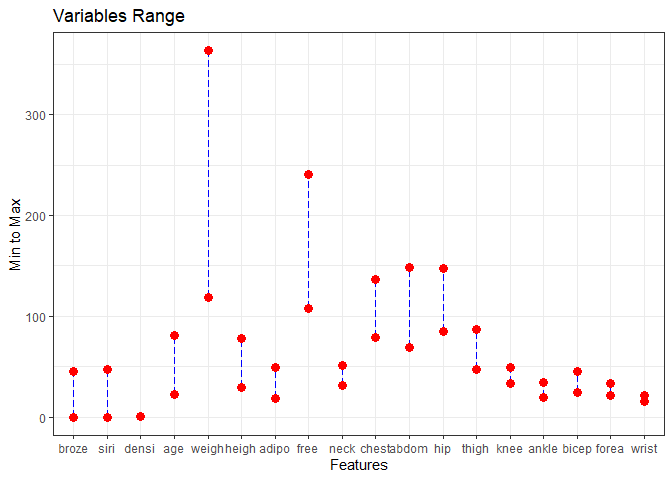
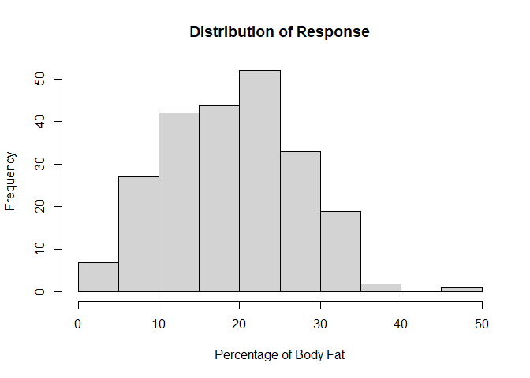
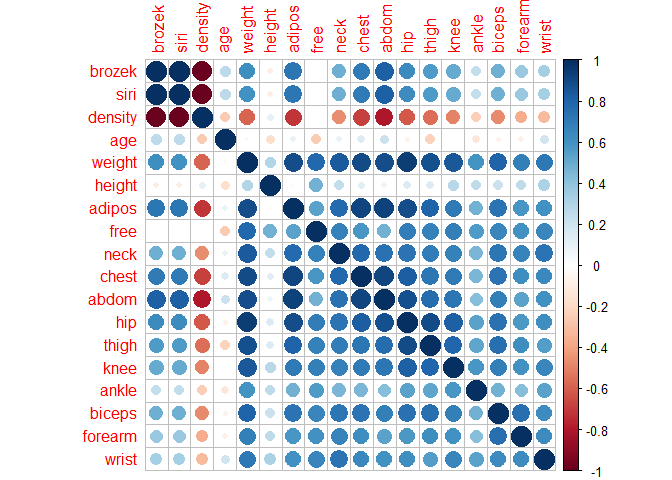
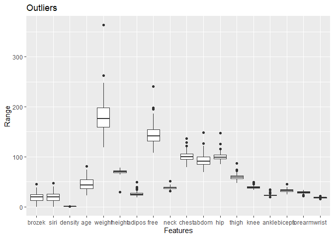
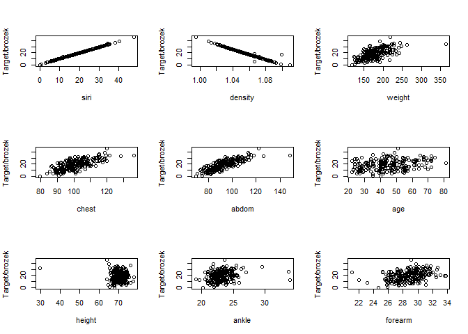
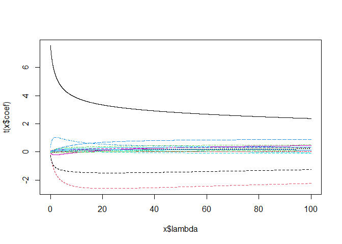
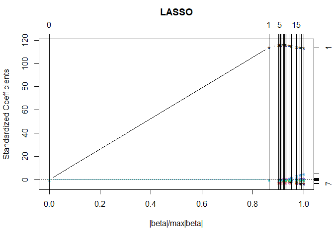
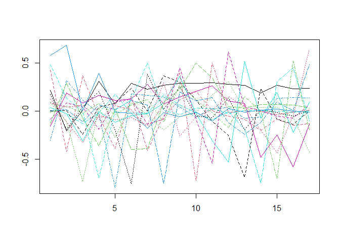
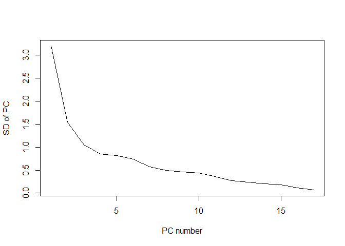

Percentage of Body Fat and Body Measurements
================

\#1. Load and display the data set

We load the data and explore the summary stats.

``` r
setwd("C://Users/WZNQMP/Desktop/OMSA/Fall_2022/DMSL/HW2")
fat <- read.table(file="fat.csv", sep = ",", header = TRUE);
```

## See sample data

To see the letter picture of the 5-th row by changing the row
observation to a matrix

``` r
head(fat)
```

<div data-pagedtable="false">

<script data-pagedtable-source type="application/json">
{"columns":[{"label":[""],"name":["_rn_"],"type":[""],"align":["left"]},{"label":["brozek"],"name":[1],"type":["dbl"],"align":["right"]},{"label":["siri"],"name":[2],"type":["dbl"],"align":["right"]},{"label":["density"],"name":[3],"type":["dbl"],"align":["right"]},{"label":["age"],"name":[4],"type":["int"],"align":["right"]},{"label":["weight"],"name":[5],"type":["dbl"],"align":["right"]},{"label":["height"],"name":[6],"type":["dbl"],"align":["right"]},{"label":["adipos"],"name":[7],"type":["dbl"],"align":["right"]},{"label":["free"],"name":[8],"type":["dbl"],"align":["right"]},{"label":["neck"],"name":[9],"type":["dbl"],"align":["right"]},{"label":["chest"],"name":[10],"type":["dbl"],"align":["right"]},{"label":["abdom"],"name":[11],"type":["dbl"],"align":["right"]},{"label":["hip"],"name":[12],"type":["dbl"],"align":["right"]},{"label":["thigh"],"name":[13],"type":["dbl"],"align":["right"]},{"label":["knee"],"name":[14],"type":["dbl"],"align":["right"]},{"label":["ankle"],"name":[15],"type":["dbl"],"align":["right"]},{"label":["biceps"],"name":[16],"type":["dbl"],"align":["right"]},{"label":["forearm"],"name":[17],"type":["dbl"],"align":["right"]},{"label":["wrist"],"name":[18],"type":["dbl"],"align":["right"]}],"data":[{"1":"12.6","2":"12.3","3":"1.0708","4":"23","5":"154.25","6":"67.75","7":"23.7","8":"134.9","9":"36.2","10":"93.1","11":"85.2","12":"94.5","13":"59.0","14":"37.3","15":"21.9","16":"32.0","17":"27.4","18":"17.1","_rn_":"1"},{"1":"6.9","2":"6.1","3":"1.0853","4":"22","5":"173.25","6":"72.25","7":"23.4","8":"161.3","9":"38.5","10":"93.6","11":"83.0","12":"98.7","13":"58.7","14":"37.3","15":"23.4","16":"30.5","17":"28.9","18":"18.2","_rn_":"2"},{"1":"24.6","2":"25.3","3":"1.0414","4":"22","5":"154.00","6":"66.25","7":"24.7","8":"116.0","9":"34.0","10":"95.8","11":"87.9","12":"99.2","13":"59.6","14":"38.9","15":"24.0","16":"28.8","17":"25.2","18":"16.6","_rn_":"3"},{"1":"10.9","2":"10.4","3":"1.0751","4":"26","5":"184.75","6":"72.25","7":"24.9","8":"164.7","9":"37.4","10":"101.8","11":"86.4","12":"101.2","13":"60.1","14":"37.3","15":"22.8","16":"32.4","17":"29.4","18":"18.2","_rn_":"4"},{"1":"27.8","2":"28.7","3":"1.0340","4":"24","5":"184.25","6":"71.25","7":"25.6","8":"133.1","9":"34.4","10":"97.3","11":"100.0","12":"101.9","13":"63.2","14":"42.2","15":"24.0","16":"32.2","17":"27.7","18":"17.7","_rn_":"5"},{"1":"20.6","2":"20.9","3":"1.0502","4":"24","5":"210.25","6":"74.75","7":"26.5","8":"167.0","9":"39.0","10":"104.5","11":"94.4","12":"107.8","13":"66.0","14":"42.0","15":"25.6","16":"35.7","17":"30.6","18":"18.8","_rn_":"6"}],"options":{"columns":{"min":{},"max":[10]},"rows":{"min":[10],"max":[10]},"pages":{}}}
  </script>

</div>

## Split the original data set into disjoint training and testing data sets

``` r
flag <- c(1, 21, 22, 57, 70, 88, 91, 94, 121, 127, 149, 151, 159,162,
          164, 177, 179, 194, 206, 214, 215, 221, 240, 241, 243);

fat1train <- fat[-flag,] 
fat1test <- fat[flag,]

sprintf("We allocate %s percent of the dataset for testing", round(length(flag)/dim(fat)[1],2)*100)
```

    ## [1] "We allocate 10 percent of the dataset for testing"

\#2. Exploratory Data Analysis of Training data

First I searched about the feature list:

## Size of data sets

``` r
dim(fat1train)
```

    ## [1] 227  18

``` r
dim(fat1test)
```

    ## [1] 25 18

## Summery Stats

``` r
# range for each variable
feature_range <- t(sapply(fat1train, range))
```

## Bar min and max graphs

The bar min and max graph is used to display range for each feature. The
bar start at the minimum value and end at the maximum value.

``` r
library(ggplot2)
# range for each variable
df <- data.frame(feature_range)
colnames(df) <- c('min','max')

lvl <- substr(rownames(feature_range), start = 1, stop = 5)
ggplot(df, aes(x= factor(lvl,levels = lvl)))+
  geom_linerange(aes(ymin=min,ymax=max),linetype=5,color="blue")+
  geom_point(aes(y=min),size=3,color="red")+
  geom_point(aes(y=max),size=3,color="red")+
  theme_bw() +
  ggtitle("Variables Range") +
  xlab("Features") + ylab("Min to Max")
```

<!-- -->

From above, we can see that the features are in different range, and
standardization is necessary. Particular, it is necessary to standardize
variables before using Lasso and Ridge Regression.We perform
standardization just before we train the model.

## Summery Stats

``` r
str(fat1train)
```

    ## 'data.frame':    227 obs. of  18 variables:
    ##  $ brozek : num  6.9 24.6 10.9 27.8 20.6 19 12.8 5.1 12 7.5 ...
    ##  $ siri   : num  6.1 25.3 10.4 28.7 20.9 19.2 12.4 4.1 11.7 7.1 ...
    ##  $ density: num  1.09 1.04 1.08 1.03 1.05 ...
    ##  $ age    : int  22 22 26 24 24 26 25 25 23 26 ...
    ##  $ weight : num  173 154 185 184 210 ...
    ##  $ height : num  72.2 66.2 72.2 71.2 74.8 ...
    ##  $ adipos : num  23.4 24.7 24.9 25.6 26.5 26.2 23.6 24.6 25.8 23.6 ...
    ##  $ free   : num  161 116 165 133 167 ...
    ##  $ neck   : num  38.5 34 37.4 34.4 39 36.4 37.8 38.1 42.1 38.5 ...
    ##  $ chest  : num  93.6 95.8 101.8 97.3 104.5 ...
    ##  $ abdom  : num  83 87.9 86.4 100 94.4 90.7 88.5 82.5 88.6 83.6 ...
    ##  $ hip    : num  98.7 99.2 101.2 101.9 107.8 ...
    ##  $ thigh  : num  58.7 59.6 60.1 63.2 66 58.4 60 62.9 63.1 59.7 ...
    ##  $ knee   : num  37.3 38.9 37.3 42.2 42 38.3 39.4 38.3 41.7 39.7 ...
    ##  $ ankle  : num  23.4 24 22.8 24 25.6 22.9 23.2 23.8 25 25.2 ...
    ##  $ biceps : num  30.5 28.8 32.4 32.2 35.7 31.9 30.5 35.9 35.6 32.8 ...
    ##  $ forearm: num  28.9 25.2 29.4 27.7 30.6 27.8 29 31.1 30 29.4 ...
    ##  $ wrist  : num  18.2 16.6 18.2 17.7 18.8 17.7 18.8 18.2 19.2 18.5 ...

## Distribution of response values

``` r
histtrain <- hist(fat1train[,1], main="Distribution of Response",xlab="Percentage of Body Fat",ylab="Frequency")
```

<!-- -->

## Correlation between each pair of predictors

Now, let’s see if there is correlation between any pair of predictors.

-   If there is a strong correlation between two features, we may
    consider including only one of those in the regression model to
    reduce the complexity of the model.

``` r
library(corrplot)
```

    ## Warning: package 'corrplot' was built under R version 4.0.5

    ## corrplot 0.84 loaded

``` r
corrplot(cor(fat1train))
```

<!-- -->

### Remove highly correlated features

We do not remove highly correlated features. Instead, we follow homework
instructions on traning different regression model.

## Verify if any outliers

Now, we investigate the outliers using box plot.

Ideally, We need to talk to a subject matter expert to decide if the
outliers are presenting specific event or circumstance or it is a
mistake in data gathering. But here we just assume all data are good for
analysis and we do not remove any data from our data set.

``` r
library("reshape2")
```

    ## Warning: package 'reshape2' was built under R version 4.0.5

``` r
library("ggplot2") 
library("ggforce")
```

    ## Warning: package 'ggforce' was built under R version 4.0.5

``` r
data_long <- melt(fat1train)                                      # Reshaping data frame
```

    ## No id variables; using all as measure variables

``` r
ggplot(data_long, aes(x = variable, y = value)) + 
  geom_boxplot(na.rm = TRUE) +
  ggtitle("Outliers") +
  xlab("Features") + ylab("Range")
```

<!-- -->

## Explore relationship between each predictors and response

Here, I am **not** looking for mathematics definition of correlation. I
just want to understand the data better.

``` r
important = c(2,3,5,10,11,4,6,15,17)
par(mfrow=c(3,3))
for (i in important) {
  plot( x = fat1train[,i], y = fat1train[,1],
        ylab = "Target/brozek", xlab = colnames(fat1train)[i])
}
```

<!-- -->

# 3. Build Classification Rules

## 3-1. Standardization

From above, we can see that the **features** are in different range, and
standardization is necessary. Particular, it is necessary to standardize
variables before using Lasso and Ridge Regression.We perform
standardization just before we train the model.

We keep the target value as it is.

``` r
m = 2:18
sd = 2:18
train.normal <- fat1train

for (i in 2:18) { # Only features
  m[i] = mean(fat1train[,i])
  sd[i] = sd(fat1train[,i])
  train.normal[,i] <- ( fat1train[,i] - m[i] ) / sd[i]
} 
```

We need to perform standardization on test data set using the mean and
variance from training data set. Note that we did not perform
standardization on whole data set, because we wanted to make sure no
information is leaked from testing data set to traning data set (impact
on mean and sigma).

``` r
test.normal <- fat1test

for (i in 2:18) { # Only features
  test.normal[,i] <- ( fat1test[,i] - m[i] ) / sd[i]
} 
```

## 3-2. Linear regression with all predictors\*

``` r
mod1 <- lm( brozek  ~ . , data= train.normal);
mod1.summary <- summary(mod1)
print(mod1.summary)
```

    ## 
    ## Call:
    ## lm(formula = brozek ~ ., data = train.normal)
    ## 
    ## Residuals:
    ##      Min       1Q   Median       3Q      Max 
    ## -1.12406 -0.04543 -0.00043  0.04959  1.44629 
    ## 
    ## Coefficients:
    ##              Estimate Std. Error  t value Pr(>|t|)    
    ## (Intercept) 18.993392   0.011842 1603.913   <2e-16 ***
    ## siri         7.556662   0.104356   72.412   <2e-16 ***
    ## density     -0.194626   0.076685   -2.538   0.0119 *  
    ## age         -0.008271   0.018112   -0.457   0.6484    
    ## weight       0.340892   0.131432    2.594   0.0102 *  
    ## height      -0.003094   0.017579   -0.176   0.8605    
    ## adipos      -0.069616   0.050656   -1.374   0.1708    
    ## free        -0.243101   0.095766   -2.538   0.0119 *  
    ## neck        -0.001531   0.024904   -0.061   0.9510    
    ## chest        0.021523   0.040670    0.529   0.5972    
    ## abdom        0.008190   0.053949    0.152   0.8795    
    ## hip         -0.026120   0.046913   -0.557   0.5783    
    ## thigh        0.077823   0.034469    2.258   0.0250 *  
    ## knee        -0.063435   0.025695   -2.469   0.0144 *  
    ## ankle        0.005537   0.016304    0.340   0.7345    
    ## biceps      -0.051971   0.023625   -2.200   0.0289 *  
    ## forearm      0.046462   0.020628    2.252   0.0253 *  
    ## wrist        0.030121   0.022009    1.369   0.1726    
    ## ---
    ## Signif. codes:  0 '***' 0.001 '**' 0.01 '*' 0.05 '.' 0.1 ' ' 1
    ## 
    ## Residual standard error: 0.1784 on 209 degrees of freedom
    ## Multiple R-squared:  0.9995, Adjusted R-squared:  0.9995 
    ## F-statistic: 2.622e+04 on 17 and 209 DF,  p-value: < 2.2e-16

*Training errors*

``` r
y1pred.train <- predict.lm(mod1, train.normal[,-1]);
mean( (y1pred.train - train.normal[,1])^2 );
```

    ## [1] 0.02930823

*Testing errors*

``` r
y1pred.test <- predict.lm(mod1, test.normal[,-1]);
mean( (y1pred.test - test.normal[,1])^2 );
```

    ## [1] 0.008755981

## 3-3. Linear regression with the best subset of k = 5 predictors variables

``` r
library(leaps);
```

    ## Warning: package 'leaps' was built under R version 4.0.5

``` r
mod2 <- regsubsets(brozek ~ ., data= train.normal, nbest= 100, really.big= TRUE); 

mod2.models <- summary(mod2)$which;
mod2.models.size <- as.numeric(attr(mod2.models, "dimnames")[[1]]);
mod2.models.rss <- summary(mod2)$rss;
```

Find the the best subset with k=5, and fit the model.

``` r
# What is the best subset with k=5
opt <- which(mod2.models.size == 5); 
flag2 <- opt[which.min(mod2.models.rss[opt])];
flag2
```

    ## [1] 318

``` r
mod2selectedmodel <- mod2.models[flag2,]; 
mod2Xname <- paste(names(mod2selectedmodel)[mod2selectedmodel][-1], collapse="+"); 
mod2Xname
```

    ## [1] "siri+density+thigh+knee+wrist"

``` r
mod2form <- paste ("brozek ~", mod2Xname);

model2 <- lm( as.formula(mod2form), data= train.normal); 
summary(model2)
```

    ## 
    ## Call:
    ## lm(formula = as.formula(mod2form), data = train.normal)
    ## 
    ## Residuals:
    ##      Min       1Q   Median       3Q      Max 
    ## -1.07829 -0.04453 -0.00062  0.03778  1.59811 
    ## 
    ## Coefficients:
    ##             Estimate Std. Error  t value Pr(>|t|)    
    ## (Intercept) 18.99339    0.01193 1591.710  < 2e-16 ***
    ## siri         7.73649    0.07585  101.996  < 2e-16 ***
    ## density     -0.17992    0.07530   -2.389  0.01771 *  
    ## thigh        0.05278    0.02101    2.512  0.01271 *  
    ## knee        -0.05934    0.02215   -2.679  0.00794 ** 
    ## wrist        0.02665    0.01591    1.675  0.09541 .  
    ## ---
    ## Signif. codes:  0 '***' 0.001 '**' 0.01 '*' 0.05 '.' 0.1 ' ' 1
    ## 
    ## Residual standard error: 0.1798 on 221 degrees of freedom
    ## Multiple R-squared:  0.9995, Adjusted R-squared:  0.9995 
    ## F-statistic: 8.778e+04 on 5 and 221 DF,  p-value: < 2.2e-16

*Training errors*

``` r
y2pred.test <- predict.lm(model2, train.normal[,-1]);
mean( (y2pred.test - train.normal[,1])^2 );
```

    ## [1] 0.03146801

*Testing errors*

``` r
y2pred.test <- predict.lm(model2, test.normal[,-1]);
mean( (y2pred.test - test.normal[,1])^2 );
```

    ## [1] 0.002786218

## 3-4. Linear regression with variables (stepwise) selected using AIC\*

``` r
library(MASS)
mod3 <- stepAIC(mod1, direction = "both", trace = FALSE)
summary(mod3)
```

    ## 
    ## Call:
    ## lm(formula = brozek ~ siri + density + weight + adipos + free + 
    ##     thigh + knee + biceps + forearm + wrist, data = train.normal)
    ## 
    ## Residuals:
    ##      Min       1Q   Median       3Q      Max 
    ## -1.12873 -0.04496 -0.00286  0.05366  1.46273 
    ## 
    ## Coefficients:
    ##             Estimate Std. Error  t value Pr(>|t|)    
    ## (Intercept) 18.99339    0.01168 1626.394  < 2e-16 ***
    ## siri         7.56371    0.09932   76.157  < 2e-16 ***
    ## density     -0.19877    0.07438   -2.672  0.00810 ** 
    ## weight       0.32598    0.12086    2.697  0.00755 ** 
    ## adipos      -0.05914    0.03455   -1.712  0.08833 .  
    ## free        -0.22881    0.09115   -2.510  0.01280 *  
    ## thigh        0.07006    0.02713    2.582  0.01048 *  
    ## knee        -0.06636    0.02405   -2.760  0.00629 ** 
    ## biceps      -0.05209    0.02298   -2.266  0.02442 *  
    ## forearm      0.04999    0.01923    2.600  0.00998 ** 
    ## wrist        0.02724    0.01875    1.453  0.14771    
    ## ---
    ## Signif. codes:  0 '***' 0.001 '**' 0.01 '*' 0.05 '.' 0.1 ' ' 1
    ## 
    ## Residual standard error: 0.176 on 216 degrees of freedom
    ## Multiple R-squared:  0.9995, Adjusted R-squared:  0.9995 
    ## F-statistic: 4.582e+04 on 10 and 216 DF,  p-value: < 2.2e-16

*Training errors*

``` r
y3pred.train <- predict.lm(mod3, train.normal[,-1]);
mean( (y3pred.train - train.normal[,1])^2 );
```

    ## [1] 0.02945827

*Testing errors*

``` r
y3pred.test <- predict.lm(mod3, test.normal[,-1]);
mean( (y3pred.test - test.normal[,1])^2 );
```

    ## [1] 0.008955971

## 3-5. Ridge regression\*

In case of ridge regression, the value of alpha is zero.

``` r
mod4 <- lm.ridge( brozek ~ ., data = train.normal, lambda= seq(0,100,0.01));
```

``` r
indexopt <-  which.min(mod4$GCV); 
ridge.coeffs <- mod4$coef[,indexopt]
ridge.coeffs
```

    ##         siri      density          age       weight       height       adipos 
    ##  7.539999481 -0.194196948 -0.008252884  0.340140147 -0.003086821 -0.069462112 
    ##         free         neck        chest        abdom          hip        thigh 
    ## -0.242564729 -0.001528091  0.021475688  0.008171671 -0.026062089  0.077651086 
    ##         knee        ankle       biceps      forearm        wrist 
    ## -0.063294970  0.005524791 -0.051856831  0.046359814  0.030054113

``` r
intercept = -as.numeric(as.vector(ridge.coeffs)%*%as.vector(colMeans(train.normal[,2:18]))) + mean(train.normal[,1])
intercept
```

    ## [1] 18.99339

``` r
plot(mod4)
```

<!-- -->

*Training errors*

``` r
y4pred.train <- as.matrix(train.normal[,-1]) %*% as.vector(mod4$coef[,indexopt]) + intercept
mean( (y4pred.train - train.normal[,1])^2 );
```

    ## [1] 0.02961211

*Testing errors*

``` r
y4pred.test <- as.matrix(test.normal[,-1]) %*% as.vector(mod4$coef[,indexopt]) + intercept
mean( (y4pred.test - test.normal[,1])^2 );
```

    ## [1] 0.008355234

## 3-6. LASSO regression\*

``` r
library(lars)
```

    ## Warning: package 'lars' was built under R version 4.0.5

    ## Loaded lars 1.3

``` r
mod5 <- lars( as.matrix(train.normal[,2:18]), train.normal[,1], type= "lasso", trace= TRUE);
```

    ## LASSO sequence
    ## Computing X'X .....
    ## LARS Step 1 :     Variable 1     added
    ## LARS Step 2 :     Variable 2     added
    ## LARS Step 3 :     Variable 12    added
    ## LARS Step 4 :     Variable 16    added
    ## LARS Step 5 :     Variable 13    added
    ## LARS Step 6 :     Variable 17    added
    ## LARS Step 7 :     Variable 15    added
    ## LARS Step 8 :     Variable 3     added
    ## LARS Step 9 :     Variable 4     added
    ## LARS Step 10 :    Variable 14    added
    ## LARS Step 11 :    Variable 7     added
    ## LARS Step 12 :    Variable 5     added
    ## LARS Step 13 :    Variable 6     added
    ## LARS Step 14 :    Variable 11    added
    ## LARS Step 15 :    Variable 9     added
    ## Lasso Step 16 :   Variable 5     dropped
    ## LARS Step 17 :    Variable 10    added
    ## LARS Step 18 :    Variable 5     added
    ## LARS Step 19 :    Variable 8     added
    ## Computing residuals, RSS etc .....

``` r
Cp1  <- summary(mod5)$Cp;
index1 <- which.min(Cp1);
index1
```

    ## [1] 9

``` r
lasso.lambda <- mod5$lambda[index1]
lasso.lambda
```

    ## [1] 0.0587987

``` r
coef.lars1 <- coef(mod5)[index1,]
coef.lars1
```

    ##         siri      density          age       weight       height       adipos 
    ##  7.733086559 -0.183098257 -0.004667023  0.000000000  0.000000000  0.000000000 
    ##         free         neck        chest        abdom          hip        thigh 
    ##  0.000000000  0.000000000  0.000000000  0.000000000  0.000000000  0.037126726 
    ##         knee        ankle       biceps      forearm        wrist 
    ## -0.032878909  0.000000000 -0.026995781  0.026069065  0.015853263

``` r
LASSOintercept = mean(train.normal[,1]) -sum( coef.lars1  * colMeans(train.normal[,2:18] ));
LASSOintercept
```

    ## [1] 18.99339

``` r
plot(mod5)
```

<!-- -->

*Training errors*

``` r
y5pred.training <- predict(mod5, as.matrix(train.normal[,2:18]), s=lasso.lambda, type="fit", mode="lambda")$fit;
mean( (y5pred.training - train.normal[,1])^2 );
```

    ## [1] 0.03085618

*Testing errors*

``` r
y5pred.test <- predict(mod5, as.matrix(test.normal[,2:18]), s=lasso.lambda, type="fit", mode="lambda")$fit;
mean( (y5pred.test - test.normal[,1])^2 );
```

    ## [1] 0.003158102

## 3-6. Principal component regression\*

``` r
trainpca <- prcomp(train.normal[,2:18]);
round(trainpca$sdev,2)
```

    ##  [1] 3.20 1.54 1.05 0.85 0.82 0.74 0.58 0.50 0.46 0.44 0.37 0.27 0.24 0.20 0.18
    ## [16] 0.12 0.07

``` r
matplot(1:17, trainpca$rot[,1:17], type ="l", xlab="", ylab="")
```

<!-- -->

``` r
plot(trainpca$sdev,type="l", ylab="SD of PC", xlab="PC number")
```

<!-- -->

``` r
mod6 <- lm(brozek ~ trainpca$x[,1:17], data = train.normal)
summary(mod6)
```

    ## 
    ## Call:
    ## lm(formula = brozek ~ trainpca$x[, 1:17], data = train.normal)
    ## 
    ## Residuals:
    ##      Min       1Q   Median       3Q      Max 
    ## -1.12406 -0.04543 -0.00043  0.04959  1.44629 
    ## 
    ## Coefficients:
    ##                         Estimate Std. Error  t value Pr(>|t|)    
    ## (Intercept)            18.993392   0.011842 1603.913  < 2e-16 ***
    ## trainpca$x[, 1:17]PC1   1.696889   0.003708  457.618  < 2e-16 ***
    ## trainpca$x[, 1:17]PC2   3.350776   0.007714  434.385  < 2e-16 ***
    ## trainpca$x[, 1:17]PC3   0.743052   0.011265   65.961  < 2e-16 ***
    ## trainpca$x[, 1:17]PC4  -2.452984   0.013958 -175.738  < 2e-16 ***
    ## trainpca$x[, 1:17]PC5   0.267980   0.014557   18.408  < 2e-16 ***
    ## trainpca$x[, 1:17]PC6  -1.297497   0.016078  -80.700  < 2e-16 ***
    ## trainpca$x[, 1:17]PC7   0.025098   0.020626    1.217    0.225    
    ## trainpca$x[, 1:17]PC8   1.012348   0.023755   42.616  < 2e-16 ***
    ## trainpca$x[, 1:17]PC9  -0.120826   0.025687   -4.704 4.64e-06 ***
    ## trainpca$x[, 1:17]PC10  0.033962   0.026970    1.259    0.209    
    ## trainpca$x[, 1:17]PC11  0.213146   0.032484    6.562 4.12e-10 ***
    ## trainpca$x[, 1:17]PC12 -0.654938   0.043635  -15.009  < 2e-16 ***
    ## trainpca$x[, 1:17]PC13  1.392900   0.049325   28.239  < 2e-16 ***
    ## trainpca$x[, 1:17]PC14  0.625886   0.057958   10.799  < 2e-16 ***
    ## trainpca$x[, 1:17]PC15 -1.027091   0.064754  -15.862  < 2e-16 ***
    ## trainpca$x[, 1:17]PC16  4.402189   0.102224   43.064  < 2e-16 ***
    ## trainpca$x[, 1:17]PC17  3.259594   0.175359   18.588  < 2e-16 ***
    ## ---
    ## Signif. codes:  0 '***' 0.001 '**' 0.01 '*' 0.05 '.' 0.1 ' ' 1
    ## 
    ## Residual standard error: 0.1784 on 209 degrees of freedom
    ## Multiple R-squared:  0.9995, Adjusted R-squared:  0.9995 
    ## F-statistic: 2.622e+04 on 17 and 209 DF,  p-value: < 2.2e-16

``` r
beta.pca <- trainpca$rot[,1:17] %*% mod6$coef[-1];
beta.pca
```

    ##                 [,1]
    ## siri     7.556662483
    ## density -0.194626114
    ## age     -0.008271123
    ## weight   0.340891839
    ## height  -0.003093643
    ## adipos  -0.069615619
    ## free    -0.243100784
    ## neck    -0.001531468
    ## chest    0.021523148
    ## abdom    0.008189730
    ## hip     -0.026119685
    ## thigh    0.077822691
    ## knee    -0.063434848
    ## ankle    0.005537000
    ## biceps  -0.051971432
    ## forearm  0.046462267
    ## wrist    0.030120531

*Training errors*

``` r
xtrainPC <-  as.matrix(train.normal[,2:18]) %*% as.matrix(trainpca$rot[,1:17])
y6pred.train <- cbind(1, xtrainPC) %*% mod6$coef;
mean( (y6pred.train - train.normal[,1])^2 );
```

    ## [1] 0.02930823

*Testing errors*

``` r
xtestPC <-  as.matrix(test.normal[,2:18]) %*% as.matrix(trainpca$rot[,1:17])
y6pred.test <- cbind(1, xtestPC) %*% mod6$coef;
mean( (y6pred.test - test.normal[,1])^2 );
```

    ## [1] 0.008755981

## 3-7. Partial least squares\*

``` r
library(pls)
```

    ## Warning: package 'pls' was built under R version 4.0.5

    ## 
    ## Attaching package: 'pls'

    ## The following object is masked from 'package:corrplot':
    ## 
    ##     corrplot

    ## The following object is masked from 'package:stats':
    ## 
    ##     loadings

``` r
mod7 <- plsr(brozek ~ ., data = train.normal, validation="CV");
mod7ncompopt <- which.min(mod7$validation$adj);
mod7ncompopt
```

    ## [1] 17

*Training errors*

``` r
y7pred.train <- predict(mod7, ncomp = mod7ncompopt, newdata = train.normal[2:18]);
mean( (y7pred.train - train.normal[,1])^2 );
```

    ## [1] 0.02930823

*Testing errors*

``` r
y7pred.test <- predict(mod7, ncomp = mod7ncompopt, newdata = test.normal[2:18]);
mean( (y7pred.test - test.normal[,1])^2 );
```

    ## [1] 0.008755981

\#4. Monte Carlo Cross-Validation

*We use Monte Carlo with B=70*

``` r
B= 70; ### number of loops
TEALL = NULL; ### Final TE values
set.seed(7406); ### You might want to set the seed for randomization
n = dim(fat)[1]; ### total number of observations
n1 = round(n/10); ### number of observations randomly selected for testing data
TEALL <- matrix(0,nrow= 7, ncol = B)

for (b in 1:B){
  ### randomly select 25 observations as testing data in each loop
  flag <- sort(sample(1:n, n1));
  fat1train <- fat[-flag,];
  fat1test <- fat[flag,];
  
  ################################
  ### Standardize the training set
  m = 2:18
  sd = 2:18
  train.normal <- fat1train
  for (i in 2:18) { # Only features
    m[i] = mean(fat1train[,i])
    sd[i] = sd(fat1train[,i])
    train.normal[,i] <- ( fat1train[,i] - m[i] ) / sd[i]
  } 
  ### Standardize the test set- but use mean and variance from training set
  test.normal <- fat1test
  for (i in 2:18) { # Only features
    test.normal[,i] <- ( fat1test[,i] - m[i] ) / sd[i]
  } 
  ################################
  ################################


  ################################
  ### Full model
  mod1 <- lm( brozek  ~ . , data= train.normal);
  y1pred.test <- predict.lm(mod1, test.normal[,-1]);
  te1 <- mean( (y1pred.test - test.normal[,1])^2 );
  ################################
  ################################

  

  ################################
  ### The best subset model k=5
  mod2 <- regsubsets(brozek ~ ., data= train.normal, nbest= 100, really.big= TRUE); 
  mod2.models <- summary(mod2)$which;
  mod2.models.size <- as.numeric(attr(mod2.models, "dimnames")[[1]]);
  mod2.models.rss <- summary(mod2)$rss;
  opt <- which(mod2.models.size == 5); 
  flag2 <- opt[which.min(mod2.models.rss[opt])];
  mod2selectedmodel <- mod2.models[flag2,]; 
  mod2Xname <- paste(names(mod2selectedmodel)[mod2selectedmodel][-1], collapse="+"); 
  mod2form <- paste ("brozek ~", mod2Xname);
  model2 <- lm( as.formula(mod2form), data= train.normal);
  y2pred.test <- predict.lm(model2, test.normal[,-1]);
  te2 <- mean( (y2pred.test - test.normal[,1])^2 );
  ################################
  ################################

  
  ################################
  ### Stepwise with AIC
  mod3 <- stepAIC(mod1, direction = "both", trace = FALSE)
  y3pred.test <- predict.lm(mod3, test.normal[,-1]);
  te3 <- mean( (y3pred.test - test.normal[,1])^2 );
  ################################
  ################################
  
 
  ################################
  ### Ridge model
  mod4 <- lm.ridge( brozek ~ ., data = train.normal, lambda= seq(0,100,0.01));
  indexopt <-  which.min(mod4$GCV); 
  ridge.coeffs <- mod4$coef[,indexopt]
  intercept = -as.numeric(as.vector(ridge.coeffs)%*%as.vector(colMeans(train.normal[,2:18]))) + mean(train.normal[,1])
  y4pred.test <- as.matrix(test.normal[,-1]) %*% as.vector(mod4$coef[,indexopt]) + intercept
  te4 <- mean( (y4pred.test - test.normal[,1])^2 );
  ################################
  ################################
  
  
  ################################
  ### LASSO model
  mod5 <- lars( as.matrix(train.normal[,2:18]), train.normal[,1], type= "lasso", trace= FALSE);
  Cp1  <- summary(mod5)$Cp;
  index1 <- which.min(Cp1);
  lasso.lambda <- mod5$lambda[index1]
  coef.lars1 <- coef(mod5)[index1,]
  LASSOintercept = mean(train.normal[,1]) -sum( coef.lars1  * colMeans(train.normal[,2:18] ));
  y5pred.test <- predict(mod5, as.matrix(test.normal[,2:18]), s=lasso.lambda, type="fit", mode="lambda")$fit;
  te5 <- mean( (y5pred.test - test.normal[,1])^2 );
  ################################
  ################################
  

  ################################
  ### Principal Component model
  mod6 <- pcr(brozek~., data=train.normal, validation="CV");
  ncompopt <- which.min(mod6$validation$adj);
  y6pred.test <- predict(mod6, ncomp = ncompopt, newdata = test.normal[2:18]); 
  te6 <- mean( (y6pred.test - test.normal[,1])^2 );
  ################################
  ################################
  
  
  ################################
  ### Partial Least Squares (PLS)
  mod7 <- plsr(brozek ~ ., data = train.normal, validation="CV");
  mod7ncompopt <- which.min(mod7$validation$adj);
  y7pred.test <- predict(mod7, ncomp = mod7ncompopt, newdata = test.normal[2:18]);
  te7 <- mean( (y7pred.test - test.normal[,1])^2 );
  ################################
  ################################
  TEALL[1:7, b] = rbind(te1, te2, te3, te4, te5, te6, te7)
}

out = data.frame(Method = c("Full", "Subset5","Stepwise", "Ridge","LASSO", "PCA","PLS"), CV.Error = TEALL,
                 mean = apply(TEALL,1,mean),
                 sd = apply(TEALL,1,sd))
```

``` r
out[,c(1,72,73)]
```

<div data-pagedtable="false">

<script data-pagedtable-source type="application/json">
{"columns":[{"label":["Method"],"name":[1],"type":["chr"],"align":["left"]},{"label":["mean"],"name":[2],"type":["dbl"],"align":["right"]},{"label":["sd"],"name":[3],"type":["dbl"],"align":["right"]}],"data":[{"1":"Full","2":"0.05505529","3":"0.08597721"},{"1":"Subset5","2":"0.04616396","3":"0.08960597"},{"1":"Stepwise","2":"0.05212560","3":"0.08916963"},{"1":"Ridge","2":"0.05591563","3":"0.08659590"},{"1":"LASSO","2":"0.04427637","3":"0.08229234"},{"1":"PCA","2":"0.05505529","3":"0.08597721"},{"1":"PLS","2":"0.05509631","3":"0.08599033"}],"options":{"columns":{"min":{},"max":[10]},"rows":{"min":[10],"max":[10]},"pages":{}}}
  </script>

</div>
