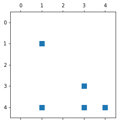

# Route Analysis  #

Exploring the New York City Yellow Taxi data


# Introduction #

Here, we explore travel data from New York City Yellow Taxi. We perform basic analysis on routes often taken.


## Summary of solution to this problem ##


Once you've loaded the data, the overall workflow consists of the following steps:

1. Read the dataset
2. Perform basic data cleaning and filtering
3. Explore the data and perform some simple processing on date and time fields
4. Perform descriptive analysis on taxi fares and travel times
4. Prepare the data for path analysis by interfacing the data with a graph/network analysis module
5. Visualize the routes by interfacing the data with a geospatial mapping module


```python
# setup
import pandas as pd
import numpy as np
import scipy as sp

from matplotlib.pyplot import figure, subplot, plot
from matplotlib.pyplot import text, title, xlabel
from seaborn import histplot

from pprint import pprint # For pretty-printing native Python data structures
```

## Part (a): Taxi Zones and Paths ##

Here is some basic information about taxi rides in NYC Taxi Dataset:

+ The Dataset contains records for taxi rides or trips.
+ Each trip starts in one "zone" and ends in another.
+ The NYC Metropolitan area is divided into 266 "zones."
+ Each zone has a unique integer ID, a name, and an administrative district (the LocationID column, Zone, Borough).

## 1. Load zones metadata, and store in a dataframe


```python
zones = load_df('nyc-taxi-data/taxi+_zone_lookup.csv').drop('service_zone', axis=1).fillna('Unknown')
zones.head()
```

    Reading a regular pandas dataframe from './resource/asnlib/publicdata/nyc-taxi-data/taxi+_zone_lookup.csv' ...
    


<div>
<style scoped>
    .dataframe tbody tr th:only-of-type {
        vertical-align: middle;
    }

    .dataframe tbody tr th {
        vertical-align: top;
    }

    .dataframe thead th {
        text-align: right;
    }
</style>
<table border="1" class="dataframe">
  <thead>
    <tr style="text-align: right;">
      <th></th>
      <th>LocationID</th>
      <th>Borough</th>
      <th>Zone</th>
    </tr>
  </thead>
  <tbody>
    <tr>
      <th>0</th>
      <td>1</td>
      <td>EWR</td>
      <td>Newark Airport</td>
    </tr>
    <tr>
      <th>1</th>
      <td>2</td>
      <td>Queens</td>
      <td>Jamaica Bay</td>
    </tr>
    <tr>
      <th>2</th>
      <td>3</td>
      <td>Bronx</td>
      <td>Allerton/Pelham Gardens</td>
    </tr>
    <tr>
      <th>3</th>
      <td>4</td>
      <td>Manhattan</td>
      <td>Alphabet City</td>
    </tr>
    <tr>
      <th>4</th>
      <td>5</td>
      <td>Staten Island</td>
      <td>Arden Heights</td>
    </tr>
  </tbody>
</table>
</div>


Each zone has a unique integer ID (the `LocationID` column), a name (`Zone`), and an administrative district (`Borough`).

Note that all location IDs from 1 to `len(zones)` are represented in this dataframe. However, you should not assume that in the exercises below.


```python
print("# of unique location IDs:", len(zones['LocationID'].unique()))
print("Some stats on location IDs:")
zones['LocationID'].describe()
```

    # of unique location IDs: 265
    Some stats on location IDs:
    


    count    265.000000
    mean     133.000000
    std       76.643112
    min        1.000000
    25%       67.000000
    50%      133.000000
    75%      199.000000
    max      265.000000
    Name: LocationID, dtype: float64


## 2. Convert the zones dataframe to zone dictionary ##

Here, we write a function which mapes location ID to the corresponding `"{zone}, {borough}"`:
+ Input: `zones dataframe ` 
+ Output: Python dictionary `location ID: "{zone}, {borough}"`.

Where the following conditions are met:

- each key is a location ID, stored as an integer;
- and each corresponding value is a string of the form, `"{zone}, {borough}"`, 
    - zone and borough are stripped of any leading or trailing whitespace
    - zone and borough are separated by a comma plus a space.

For example:

```python
{1: 'Newark Airport, EWR', 2: 'Jamaica Bay, Queens', 3: 'Allerton/Pelham Gardens, Bronx'}
```


```python
def zones_to_dict(zones):  
    def concatenate_zones(row):
        borough = row['Borough'].strip()
        zones = row['Zone'].strip()        
        return (zones + ", " + borough )
    
    zones_df = zones.copy()
    zones_df['key'] = zones_df.apply(concatenate_zones, axis=1)
    del zones_df['Borough']
    del zones_df['Zone']
    zones_dict = pd.Series(zones_df['key'].values,index=zones_df['LocationID'].values).to_dict()
    
    return zones_dict

```


```python
# Demo:
zones_to_dict(zones.iloc[:3]) # Sample output on the first three examples of `zones`
```


    {1: 'Newark Airport, EWR',
     2: 'Jamaica Bay, Queens',
     3: 'Allerton/Pelham Gardens, Bronx'}


## 3.  Generate the list of zones travled through each path ##

A _path_ is a sequence of zones. Here, we write a function which genearte the list of zone names, in the same sequence as they appear in the path `p`. 

Complete the function, `path_to_zones(p, zones_dict)`, below. It takes as input two objects:

+ Input: 
    - Path, `p`, given as an iterable sequence of integer location IDs
    - Zone dictionary mapping location IDs to string values. We created this dictionary in last section.

+ Output: A Python list of zone names, in the same sequence as they appear in the path:
`"{loc_id}. {zone_borough_name}"`. 

For example,

```python
    path_to_zones([3, 2, 1], zones_dict) == ["3. Allerton/Pelham Gardens, Bronx",
                                             "2. Jamaica Bay, Queens",
                                             "1. Newark Airport, EWR"]
```


```python
def path_to_zones(p, zones_dict):
    path_list = [""] * len(p)
    index = 0
    for location_id in p:
        zone = zones_dict[location_id]
        zone = str(location_id) + ". " + zone
        path_list[index] = zone
        index +=1
        
    return path_list

```


```python
# Demo:
path_to_zones([3, 2, 1], zones_dict)
```


    ['3. Allerton/Pelham Gardens, Bronx',
     '2. Jamaica Bay, Queens',
     '1. Newark Airport, EWR']


## Part (b): Taxi trip data ##

Here, we process the taxi trip data.


```python
!date
taxi_trips_raw_dfs = []
for month in ['06']: #, '07', '08']:
    taxi_trips_raw_dfs.append(load_df(f"nyc-taxi-data/yellow_tripdata_2019-{month}.csv",
                                      parse_dates=['tpep_pickup_datetime', 'tpep_dropoff_datetime']))
taxi_trips_raw = pd.concat(taxi_trips_raw_dfs)
del taxi_trips_raw_dfs # Save some memory
!date
```

    Sun 31 Oct 2021 04:40:46 PM PDT
    Reading a regular pandas dataframe from './resource/asnlib/publicdata/nyc-taxi-data/yellow_tripdata_2019-06.csv' ...
    Sun 31 Oct 2021 04:41:00 PM PDT
    


```python
print(f"The raw taxi trips data has {len(taxi_trips_raw):,} records (rows). Here's a sample:")
taxi_trips_raw.head()
```

    The raw taxi trips data has 6,941,024 records (rows). Here's a sample:
    


<div>
<style scoped>
    .dataframe tbody tr th:only-of-type {
        vertical-align: middle;
    }

    .dataframe tbody tr th {
        vertical-align: top;
    }

    .dataframe thead th {
        text-align: right;
    }
</style>
<table border="1" class="dataframe">
  <thead>
    <tr style="text-align: right;">
      <th></th>
      <th>VendorID</th>
      <th>tpep_pickup_datetime</th>
      <th>tpep_dropoff_datetime</th>
      <th>passenger_count</th>
      <th>trip_distance</th>
      <th>RatecodeID</th>
      <th>store_and_fwd_flag</th>
      <th>PULocationID</th>
      <th>DOLocationID</th>
      <th>payment_type</th>
      <th>fare_amount</th>
      <th>extra</th>
      <th>mta_tax</th>
      <th>tip_amount</th>
      <th>tolls_amount</th>
      <th>improvement_surcharge</th>
      <th>total_amount</th>
      <th>congestion_surcharge</th>
    </tr>
  </thead>
  <tbody>
    <tr>
      <th>0</th>
      <td>1</td>
      <td>2019-06-01 00:55:13</td>
      <td>2019-06-01 00:56:17</td>
      <td>1</td>
      <td>0.0</td>
      <td>1</td>
      <td>N</td>
      <td>145</td>
      <td>145</td>
      <td>2</td>
      <td>3.0</td>
      <td>0.5</td>
      <td>0.5</td>
      <td>0.00</td>
      <td>0.0</td>
      <td>0.3</td>
      <td>4.30</td>
      <td>0.0</td>
    </tr>
    <tr>
      <th>1</th>
      <td>1</td>
      <td>2019-06-01 00:06:31</td>
      <td>2019-06-01 00:06:52</td>
      <td>1</td>
      <td>0.0</td>
      <td>1</td>
      <td>N</td>
      <td>262</td>
      <td>263</td>
      <td>2</td>
      <td>2.5</td>
      <td>3.0</td>
      <td>0.5</td>
      <td>0.00</td>
      <td>0.0</td>
      <td>0.3</td>
      <td>6.30</td>
      <td>2.5</td>
    </tr>
    <tr>
      <th>2</th>
      <td>1</td>
      <td>2019-06-01 00:17:05</td>
      <td>2019-06-01 00:36:38</td>
      <td>1</td>
      <td>4.4</td>
      <td>1</td>
      <td>N</td>
      <td>74</td>
      <td>7</td>
      <td>2</td>
      <td>17.5</td>
      <td>0.5</td>
      <td>0.5</td>
      <td>0.00</td>
      <td>0.0</td>
      <td>0.3</td>
      <td>18.80</td>
      <td>0.0</td>
    </tr>
    <tr>
      <th>3</th>
      <td>1</td>
      <td>2019-06-01 00:59:02</td>
      <td>2019-06-01 00:59:12</td>
      <td>0</td>
      <td>0.8</td>
      <td>1</td>
      <td>N</td>
      <td>145</td>
      <td>145</td>
      <td>2</td>
      <td>2.5</td>
      <td>1.0</td>
      <td>0.5</td>
      <td>0.00</td>
      <td>0.0</td>
      <td>0.3</td>
      <td>4.30</td>
      <td>0.0</td>
    </tr>
    <tr>
      <th>4</th>
      <td>1</td>
      <td>2019-06-01 00:03:25</td>
      <td>2019-06-01 00:15:42</td>
      <td>1</td>
      <td>1.7</td>
      <td>1</td>
      <td>N</td>
      <td>113</td>
      <td>148</td>
      <td>1</td>
      <td>9.5</td>
      <td>3.0</td>
      <td>0.5</td>
      <td>2.65</td>
      <td>0.0</td>
      <td>0.3</td>
      <td>15.95</td>
      <td>2.5</td>
    </tr>
  </tbody>
</table>
</div>


## 4.  Filter the data ##

Here, we write a function to filter the dataframe, and return a new dataframe with only the columns listed below. 

1. Pick-up location ID, `'PULocationID'`, which should be renamed to `'I'` in the new dataframe.
2. Drop-off location ID, `'DOLocationID'`, which should be renamed to `'J'`.
3. Trip distance in miles, `'trip_distance'`, which should be renamed to `'D'` (for "distance").
4. The fare amount (cost) in dollars, `'fare_amount'`, which should be renamed to `'C'` (for "cost").
5. The pick-up time, `'tpep_pickup_datetime'`, which should be renamed to `'T_start'`.
6. The drop-off time, `'tpep_dropoff_datetime'`, which should be renamed to `'T_end'`.


```python
def focus(trips_raw):
    col_names = ['PULocationID', 'DOLocationID', 'trip_distance', 'fare_amount', 
                'tpep_pickup_datetime', 'tpep_dropoff_datetime']
    
    new_col_names = ['I', 'J', 'D', 'C', 'T_start', 'T_end']
    col_dict = dict (zip (col_names, new_col_names))
    
    new_df = trips_raw[col_names].copy()
    new_df.rename(columns=col_dict, inplace=True)
    
    return new_df
```


```python
# Demo:
focus(taxi_trips_raw.iloc[:3])
```


<div>
<style scoped>
    .dataframe tbody tr th:only-of-type {
        vertical-align: middle;
    }

    .dataframe tbody tr th {
        vertical-align: top;
    }

    .dataframe thead th {
        text-align: right;
    }
</style>
<table border="1" class="dataframe">
  <thead>
    <tr style="text-align: right;">
      <th></th>
      <th>I</th>
      <th>J</th>
      <th>D</th>
      <th>C</th>
      <th>T_start</th>
      <th>T_end</th>
    </tr>
  </thead>
  <tbody>
    <tr>
      <th>0</th>
      <td>145</td>
      <td>145</td>
      <td>0.0</td>
      <td>3.0</td>
      <td>2019-06-01 00:55:13</td>
      <td>2019-06-01 00:56:17</td>
    </tr>
    <tr>
      <th>1</th>
      <td>262</td>
      <td>263</td>
      <td>0.0</td>
      <td>2.5</td>
      <td>2019-06-01 00:06:31</td>
      <td>2019-06-01 00:06:52</td>
    </tr>
    <tr>
      <th>2</th>
      <td>74</td>
      <td>7</td>
      <td>4.4</td>
      <td>17.5</td>
      <td>2019-06-01 00:17:05</td>
      <td>2019-06-01 00:36:38</td>
    </tr>
  </tbody>
</table>
</div>


## Part (c): Date/Time objects  ##

The dataframe generated in Part(b) includes two columns: trip start and stop times. These are stored as native Python `datetime` objects.

## 5.  Calculate the travel time for each trip ##

Here, we write a funcction which calulates the total number of **minutes** that elapsed between the trip start and end for each trip.

+ Input: "focused" trips dataframe with `'T_start'` and `'T_end'` columns

+ Output: a pandas `Series` object of floating-point values


For example:

```
0     1.066667
1     0.350000
2    19.550000
dtype: float64
```


```python
def get_minutes(trips):
    dt_series =  (trips['T_end'] - trips['T_start']).iloc[:]
    dt_series = dt_series.dt.total_seconds() / 60
    
    return dt_series
```


```python
# Demo:
get_minutes(trips.head(3))
```


    0     1.066667
    1     0.350000
    2    19.550000
    dtype: float64


## Part (d): Data Cleaning  ##

Our data has several issues. I have listed some of the identified issues:

- The trip-distances column (`'D'`) has distances bteween and including 0 miles- 45,000 miles. 
- The fare-amount includes _negative_ costs and costs as large as 346,949.99 USD. _(Sure, NYC is expensive, but ... seriously?)_
- The trip-times includes negative values, and times as high as 1,500 minutes (over 24 hours! Barney Stinson?).

It seems we have some outlieres in our data. Ideally, we should consult with Subject Matter Expert to see if this outliers are possibly valid or there has been an error while recording the information. It's possible these are legitimate data points. But to avoid skewing our later analyses too much, let's get rid of them.


```python
assert 'trip_times' in globals()

trips[['D', 'C', 'T']].describe()
```


<div>
<style scoped>
    .dataframe tbody tr th:only-of-type {
        vertical-align: middle;
    }

    .dataframe tbody tr th {
        vertical-align: top;
    }

    .dataframe thead th {
        text-align: right;
    }
</style>
<table border="1" class="dataframe">
  <thead>
    <tr style="text-align: right;">
      <th></th>
      <th>D</th>
      <th>C</th>
      <th>T</th>
    </tr>
  </thead>
  <tbody>
    <tr>
      <th>count</th>
      <td>6.941024e+06</td>
      <td>6.941024e+06</td>
      <td>6.941024e+06</td>
    </tr>
    <tr>
      <th>mean</th>
      <td>3.078505e+00</td>
      <td>1.366414e+01</td>
      <td>1.871131e+01</td>
    </tr>
    <tr>
      <th>std</th>
      <td>1.790048e+01</td>
      <td>1.323297e+02</td>
      <td>7.207988e+01</td>
    </tr>
    <tr>
      <th>min</th>
      <td>0.000000e+00</td>
      <td>-3.050000e+02</td>
      <td>-4.279383e+03</td>
    </tr>
    <tr>
      <th>25%</th>
      <td>1.000000e+00</td>
      <td>6.500000e+00</td>
      <td>6.866667e+00</td>
    </tr>
    <tr>
      <th>50%</th>
      <td>1.680000e+00</td>
      <td>9.500000e+00</td>
      <td>1.160000e+01</td>
    </tr>
    <tr>
      <th>75%</th>
      <td>3.140000e+00</td>
      <td>1.500000e+01</td>
      <td>1.916667e+01</td>
    </tr>
    <tr>
      <th>max</th>
      <td>4.597722e+04</td>
      <td>3.469500e+05</td>
      <td>1.503383e+03</td>
    </tr>
  </tbody>
</table>
</div>


## 6. Filter the valid data ##

Here, we write a function which can determine which values of a pandas series lie within a desired interval.

This function's inputs are:

- `s`: A pandas `Series` to analyze.
- `lower`: A lower-bound on desired values, or `None` for no lower-bound (i.e., a "bound" of $-\infty$).
- `upper`: An upper-bound on desired values, or `None` for no upper-bound (i.e., $+\infty$).
- `include_lower`: A flag set to `True` if the lower-bound is _inclusive_, or `False` if it is _strict_. (See below.)
- `include_upper`: A flag set to `True` if the upper-bound is inclusive, or `False` if it is strict.


This function's output are:
- a pandas `Series` of boolean values (`True` or `False`), where an entry is `True` only if the corresponding value of `s` lies within the desired bounds.


For example:

```python
filter_bounds(s, lower=-2, upper=4, include_lower=True, include_upper=True) \
  == pd.Series([False, True, False, True, False, False, False, True, True, False])
              #    10,    2,   -10,   -2,    -9,     9,     5,    1,    2,     8
```


```python
def filter_bounds(s, lower=None, upper=None, include_lower=False, include_upper=False):
    #Lower
    if(lower != None):
        flags_lower = lower_bounds(s, lower, include_lower)
    else:
        flags_lower = pd.Series([True]*len(s))
    
    #Upper
    if (upper != None):
        flags_upper = upper_bounds(s, upper, include_upper)
    else:
        flags_upper = pd.Series([True]*len(s))
     
        
    return (flags_lower & flags_upper )     


def upper_bounds(s, upper, include_upper):
    filtered_upper = pd.Series([False]*len(s))
    if include_upper:
        filtered_upper = s.apply(lambda x: x <= upper)
    else:
        filtered_upper = s.apply(lambda x: x < upper)
        
    return filtered_upper 


#
def lower_bounds(s, lower, include_lower):
    filtered_lower = pd.Series([False]*len(s))
    if include_lower:
        filtered_lower = s.apply(lambda x: x >= lower)
    else:
        filtered_lower = s.apply(lambda x: x > lower)
            
    return filtered_lower        

```


```python
# Demo
ex4_s_demo = pd.Series([10, 2, -10, -2, -9, 9, 5, 1, 2, 8])
print(f"Input:\n{ex4_s_demo.values}")

ex4_demo1 = filter_bounds(ex4_s_demo, lower=-2, upper=4, include_lower=True, include_upper=True)
print(f"\n* [-2, 4], i.e., -2 <= x <= 4:\n{ex4_demo1.values}")

ex4_demo2 = filter_bounds(ex4_s_demo, lower=2)
print(f"\n* (2, infinity), i.e., 2 < x:\n{ex4_demo2.values}")
```

    Input:
    [ 10   2 -10  -2  -9   9   5   1   2   8]
    
    * [-2, 4], i.e., -2 <= x <= 4:
    [False  True False  True False False False  True  True False]
    
    * (2, infinity), i.e., 2 < x:
    [ True False False False False  True  True False False  True]
    

## 7. Count how many trips there are between pairs of zones ##

Here, we write a function which counts how many trips there are between pairs of zones, **and** retains only those where the count is at least a certain value. 

This function's inputs are:

- `trip_coords`: a pandas `DataFrame` with two columns, `'I'` and `'J'`, indicating start/end zone pairs
- `min_trips`: the minimum number of trips to consider (the default is 0, meaning include all pairs)

This function's output is: a pandas `DataFrame` object with three columns

- `'I'`: the starting zone;
- `'J'`: the ending zone; and
- `'N'`: the number of trips originating at `'I'` and ending at `'J'`.

Trip should be listed only where `'N'` >= `min_trips`.


```python
def count_trips(trip_coords, min_trips=0):
    trips_count = pd.DataFrame( {'N' : trip_coords.groupby( ['I', 'J'] ).size()}).reset_index()
    trips_count = trips_count[ trips_count['N'] >= min_trips]
    
    return trips_count

```


```python
# Demo:
ex5_df = trips_clean[((trips_clean['I'] == 85) & (trips_clean['J'] == 217))
                     | ((trips_clean['I'] == 139) & (trips_clean['J'] == 28))
                     | ((trips_clean['I'] == 231) & (trips_clean['J'] == 128))
                     | ((trips_clean['I'] == 169) & (trips_clean['J'] == 51))] \
                    [['I', 'J']] \
                    .reset_index(drop=True)
display(ex5_df)
count_trips(ex5_df, min_trips=3)
```


<div>
<style scoped>
    .dataframe tbody tr th:only-of-type {
        vertical-align: middle;
    }

    .dataframe tbody tr th {
        vertical-align: top;
    }

    .dataframe thead th {
        text-align: right;
    }
</style>
<table border="1" class="dataframe">
  <thead>
    <tr style="text-align: right;">
      <th></th>
      <th>I</th>
      <th>J</th>
    </tr>
  </thead>
  <tbody>
    <tr>
      <th>0</th>
      <td>169</td>
      <td>51</td>
    </tr>
    <tr>
      <th>1</th>
      <td>231</td>
      <td>128</td>
    </tr>
    <tr>
      <th>2</th>
      <td>139</td>
      <td>28</td>
    </tr>
    <tr>
      <th>3</th>
      <td>231</td>
      <td>128</td>
    </tr>
    <tr>
      <th>4</th>
      <td>169</td>
      <td>51</td>
    </tr>
    <tr>
      <th>5</th>
      <td>139</td>
      <td>28</td>
    </tr>
    <tr>
      <th>6</th>
      <td>231</td>
      <td>128</td>
    </tr>
    <tr>
      <th>7</th>
      <td>85</td>
      <td>217</td>
    </tr>
    <tr>
      <th>8</th>
      <td>169</td>
      <td>51</td>
    </tr>
    <tr>
      <th>9</th>
      <td>169</td>
      <td>51</td>
    </tr>
  </tbody>
</table>
</div>


<div>
<style scoped>
    .dataframe tbody tr th:only-of-type {
        vertical-align: middle;
    }

    .dataframe tbody tr th {
        vertical-align: top;
    }

    .dataframe thead th {
        text-align: right;
    }
</style>
<table border="1" class="dataframe">
  <thead>
    <tr style="text-align: right;">
      <th></th>
      <th>I</th>
      <th>J</th>
      <th>N</th>
    </tr>
  </thead>
  <tbody>
    <tr>
      <th>2</th>
      <td>169</td>
      <td>51</td>
      <td>4</td>
    </tr>
    <tr>
      <th>3</th>
      <td>231</td>
      <td>128</td>
      <td>3</td>
    </tr>
  </tbody>
</table>
</div>


## Part (e): Basic analysis ##

Here, we conduct some simple analyses.


## 8. Visualize the distributions of trips ##
Here, we visualize the distributions of distance, time, and cost.


```python
figure(figsize=(18, 6))
subplot(1, 3, 1)
histplot(data=trips_clean, x='D', stat='density')
xlabel("Distance (miles)")
subplot(1, 3, 2)
histplot(data=trips_clean, x='T', stat='density')
xlabel("Time (minutes)")
subplot(1, 3, 3)
histplot(data=trips_clean, x='C', stat='density')
xlabel("Cost (US Dollars)")
pass
```


    

    


## 9.  Translate the hour ranges to strings  ##

Here, we write a function which determine the hour, as an integer between 0-23 inclusive, corresponding to a 24-hour clock, and return a new pandas `Series` object with hour ranges converted to strings as follows:

- Hours 0-5 inclusive => `'wee hours'`
- Hours 6-11 inclusive => `'morning'`
- Hours 12-17 inclusive => `'afternoon'`
- Hours 18-23 inclusive => `'evening'`


```python
def part_of_day(tss):
    df= tss.copy()
    df= df.dt.hour
    df = df.apply(daytime_name)
    
    
    return df

def daytime_name(hour):
    name = ['wee hours', 'morning', 'afternoon', 'evening']
    if (hour >=0) and (hour <=5):
        return name[0]
    
    elif (hour >=6) and (hour <= 11):
        return name[1]
    
    elif (hour >=12)and (hour <= 17):
        return name[2]                  
    
    elif (hour >=18)and (hour <= 23):
        return name[3]
```


```python
# Demo:
print("* Sample input `Series`:")
ex6_demo = trips_clean['T_start'].iloc[[20, 37752, 155816, 382741]]
display(ex6_demo)

print("\n* Your output:")
part_of_day(ex6_demo)
```

    * Sample input `Series`:
    


    23       2019-06-01 00:30:42
    39781    2019-06-01 06:42:38
    164505   2019-06-01 17:40:07
    404098   2019-06-02 18:35:08
    Name: T_start, dtype: datetime64[ns]


    
    * Your output:
    


    23        wee hours
    39781       morning
    164505    afternoon
    404098      evening
    Name: T_start, dtype: object


## Part (f): Finding alternative path  ##

Here, we see if we can identify potential paths through the city that are cheaper or faster. By analogy, when you are shopping for flights, you might sometimes find that a route through a particular city (e.g., New York to Houston to Los Angeles) is cheaper than flying directly from New York to Los Angeles. Are there such _potential_ routes in the taxi dataset?

## 10.  Calculate the median trip cost for direct routes ##

**Direct "routes."** The taxi dataset itself contains "direct routes" between pairs of zones.

To start, for each pair of zones, let's calculate the median trip cost.


```python
pair_costs = trips_clean[['I', 'J', 'C']].groupby(['I', 'J']).median().reset_index()
pair_costs.head()
```


<div>
<style scoped>
    .dataframe tbody tr th:only-of-type {
        vertical-align: middle;
    }

    .dataframe tbody tr th {
        vertical-align: top;
    }

    .dataframe thead th {
        text-align: right;
    }
</style>
<table border="1" class="dataframe">
  <thead>
    <tr style="text-align: right;">
      <th></th>
      <th>I</th>
      <th>J</th>
      <th>C</th>
    </tr>
  </thead>
  <tbody>
    <tr>
      <th>0</th>
      <td>1</td>
      <td>1</td>
      <td>89.0</td>
    </tr>
    <tr>
      <th>1</th>
      <td>1</td>
      <td>158</td>
      <td>30.0</td>
    </tr>
    <tr>
      <th>2</th>
      <td>1</td>
      <td>161</td>
      <td>8.5</td>
    </tr>
    <tr>
      <th>3</th>
      <td>1</td>
      <td>162</td>
      <td>55.0</td>
    </tr>
    <tr>
      <th>4</th>
      <td>1</td>
      <td>163</td>
      <td>75.0</td>
    </tr>
  </tbody>
</table>
</div>


In the sample output above, the columns `'I'` and `'J'` are the starting and ending zones, and `C` is the median (dollar) cost to travel from zone `'I'` to zone `'J'`. Here are the most expensive zone-to-zone trips:


```python
pair_costs.sort_values(by='C', ascending=False).head()
```


<div>
<style scoped>
    .dataframe tbody tr th:only-of-type {
        vertical-align: middle;
    }

    .dataframe tbody tr th {
        vertical-align: top;
    }

    .dataframe thead th {
        text-align: right;
    }
</style>
<table border="1" class="dataframe">
  <thead>
    <tr style="text-align: right;">
      <th></th>
      <th>I</th>
      <th>J</th>
      <th>C</th>
    </tr>
  </thead>
  <tbody>
    <tr>
      <th>8321</th>
      <td>83</td>
      <td>1</td>
      <td>99.0</td>
    </tr>
    <tr>
      <th>3256</th>
      <td>39</td>
      <td>244</td>
      <td>99.0</td>
    </tr>
    <tr>
      <th>2938</th>
      <td>37</td>
      <td>1</td>
      <td>98.5</td>
    </tr>
    <tr>
      <th>15997</th>
      <td>151</td>
      <td>86</td>
      <td>98.0</td>
    </tr>
    <tr>
      <th>2180</th>
      <td>28</td>
      <td>1</td>
      <td>97.5</td>
    </tr>
  </tbody>
</table>
</div>


For the path analysis, we'll need to convert `pair_costs` into a sparse matrix representation. That is your next (and final) task.

## 10. Convert pair_costs into a sparse matrix representation ##

Here, we write function which return a Scipy sparse matrix in CSR (compressed sparse row) format.


```python
from scipy.sparse import csr_matrix

def make_csr(pair_costs, n):
    A =  [[0 for col in range(n)] for row in range(n)]
    for row in pair_costs.itertuples():
        vals = list(row)[1:4]
        i = vals[0]
        j = vals[1]
        c = vals[2]
        A[i][j] = c
    SparsA = csr_matrix(A)

    
    return SparsA
```


```python
# Demo:
ex7_demo = pair_costs[(pair_costs['I'] <= 4) & (pair_costs['J'] <= 4)]
display(ex7_demo)

# Call your code to convert:
ex7_csr = make_csr(ex7_demo, 5)
assert isinstance(ex7_csr, sp.sparse.csr.csr_matrix), "Not a Scipy CSR sparse matrix?"

# Try to visualize:
from matplotlib.pyplot import spy
spy(ex7_csr);
```


<div>
<style scoped>
    .dataframe tbody tr th:only-of-type {
        vertical-align: middle;
    }

    .dataframe tbody tr th {
        vertical-align: top;
    }

    .dataframe thead th {
        text-align: right;
    }
</style>
<table border="1" class="dataframe">
  <thead>
    <tr style="text-align: right;">
      <th></th>
      <th>I</th>
      <th>J</th>
      <th>C</th>
    </tr>
  </thead>
  <tbody>
    <tr>
      <th>0</th>
      <td>1</td>
      <td>1</td>
      <td>89.0</td>
    </tr>
    <tr>
      <th>19</th>
      <td>3</td>
      <td>3</td>
      <td>10.0</td>
    </tr>
    <tr>
      <th>71</th>
      <td>4</td>
      <td>1</td>
      <td>70.0</td>
    </tr>
    <tr>
      <th>72</th>
      <td>4</td>
      <td>3</td>
      <td>46.0</td>
    </tr>
    <tr>
      <th>73</th>
      <td>4</td>
      <td>4</td>
      <td>5.0</td>
    </tr>
  </tbody>
</table>
</div>


    

    


## 11. Find the cheapest path ##

Here, we setup a graph using NetworkX graph representation. The weight of every edge of this graph is the value of the corresponding entry of the sparse matrix (cost). The weight of every edge of this graph is the travel cost for travelling between two zones.

One cool aspect of the NetworkX graph representation is that we can perform graph queries. Here, we look for the shortest path---that is, the sequence of vertices such that traversing their edges yields a path whose total weight is the smallest among all possible paths. The shortest path refers to the trip route which yields to the lowest cost.

The function `get_shortest_path(G, i, j)` finds the shortest path in the graph `G` going between `i` and `j`, and returns the path as a list of vertices along with the length of that path:


```python
from networkx import from_scipy_sparse_matrix

Cost_graph = from_scipy_sparse_matrix(Cost_matrix)
```


```python
def get_shortest_path(G, i, j):
    from networkx import shortest_path, shortest_path_length
    p = shortest_path(G, source=i, target=j, weight='weight')
    l = shortest_path_length(G, source=i, target=j, weight='weight')
    return p, l

# Demo: Check out the shortest path between 83 and 1
path_83_1, length_83_1 = get_shortest_path(Cost_graph, 83, 1)
print("Path:", path_83_1)
print("Length", length_83_1, "via the above path vs.", Cost_matrix[83, 1], '("direct")')
```

    Path: [83, 233, 156, 1]
    Length 69.5 via the above path vs. 99.0 ("direct")
    

# Interesting Observation #
In the example above, the path starting at 83 and going through 233 and 156 before arriving at 1 has a cost of 69.5. Compare that to the direct path cost of 99!

Here is a visual representation of that path (run the next two cells).


```python
shapes = load_geopandas('nyc-taxi-data/zone-shapes/geo_export_28967859-3b38-43de-a1a2-26aee980d05c.shp')
shapes['location_i'] = shapes['location_i'].astype(int)
```

    Opening geopandas data file, './resource/asnlib/publicdata/nyc-taxi-data/zone-shapes/geo_export_28967859-3b38-43de-a1a2-26aee980d05c.shp' ...
    


```python
from testing_tools import plot_path

demo_i, demo_j = 83, 1
demo_path, demo_length = get_shortest_path(Cost_graph, demo_i, demo_j)
pprint(path_to_zones(demo_path, zones_dict))
print(f"==> Cost is {demo_length} compared to the direct cost of {Cost_graph[demo_i][demo_j]['weight']}")
plot_path(demo_path, shapes)
```

    ['83. Elmhurst/Maspeth, Queens',
     '233. UN/Turtle Bay South, Manhattan',
     '156. Mariners Harbor, Staten Island',
     '1. Newark Airport, EWR']
    ==> Cost is 69.5 compared to the direct cost of 99.0
    


    [83, 233, 156, 1]


    

    

